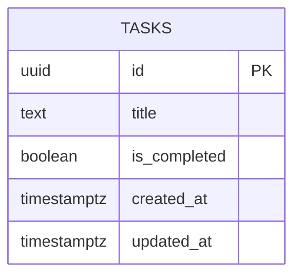

# Database Design (ERD) — Todo List App v5

Engine: PostgreSQL 16
Last updated: 2026-08-12
Source requirements: `docs/tasks/SRS.md`

## 1. Overview

This schema stores one shared todo list for all visitors. `tasks` is the only aggregate root: each row is one saved task with stable identity, title, completion state, and system-defined creation ordering. Login, users, private lists, due dates, priorities, notes, search, editing history, offline sync, notifications, and custom ordering are deliberately out of scope and not stored.

## 2. Diagram

Relationships: none. SRS requires one shared list with no login and no parent entity.

## 3. Entities

### 3.1 `tasks`

**Purpose** — Persist tasks in the shared todo list. **Traces to** — TASKS-001, TASKS-002, TASKS-003, TASKS-004.

| Column | Type | Null | Default | Unique | Description |
|---|---|---|---|---|---|
| `id` | `uuid` | no | `gen_random_uuid()` | PK | Stable surrogate key for update and delete operations. |
| `title` | `text` | no | none | no | Trimmed task title shown in list. |
| `is_completed` | `boolean` | no | `false` | no | Completion status; `false` means active. |
| `created_at` | `timestamptz` | no | `now()` | no | Creation time used for default newest-first ordering. |
| `updated_at` | `timestamptz` | no | `now()` | no | Last database update time for status changes. |

**Nullable columns** — none.

**Foreign keys**

None. No login, no private lists, no parent objects in scope.

**Constraints**

- `ck_tasks_title_length`: `length(title) BETWEEN 1 AND 80`. Enforces TASKS-001 after backend trims input.
- `title` is not unique. Duplicate titles are accepted as separate tasks by TASKS-001 and TASKS-004.

**Indexes**

| Name | Columns | Type | Query it serves |
|---|---|---|---|
| `idx_tasks_created_at_id` | `created_at DESC, id DESC` | btree | List saved tasks sorted by `created_at` descending, then stable `id` descending for tie-breaks (TASKS-002). |

**Lifecycle** — hard delete. TASKS-004 requires deleted tasks stay removed, with no retention/audit requirement and no children that need history.

## 4. Enumerations

No enumerations. Completion status is boolean because SRS has exactly two states: active and complete.

## 5. Access patterns

| # | Pattern | Frequency | Index used |
|---|---|---|---|
| 1 | List all tasks ordered by `created_at DESC, id DESC`. | On page load, retry, and after refresh. | `idx_tasks_created_at_id` |
| 2 | Insert task with trimmed title and default active status. | Per add action. | Primary key only; no lookup. |
| 3 | Update one task by stable `id` to toggle `is_completed`. | Per complete/active toggle. | Primary key. |
| 4 | Delete one task by stable `id`. | Per delete action. | Primary key. |
| 5 | Count active and completed tasks. | Derived after loading tasks and after changes. | No separate index; current app loads whole shared list and expected volume is small. |

## 6. Data volume and growth

| Table | Rows at launch | Growth | Retention |
|---|---|---|---|
| `tasks` | 0 | Low, visitor-created; expected under 10,000 rows/month for this simple shared app. | Until explicit hard delete. |

No table is expected to exceed 10M rows within a year. No partitioning or archival needed now.

## 7. Integrity, privacy, and security

- Database enforces stable primary key, non-null required fields, default active status, title length, timestamps, and duplicate-title allowance.
- Application enforces trimming, user-facing validation messages, and rollback/error UX because those are interaction concerns.
- No personal data is required. `title` is visitor-entered text and may contain personal data by user choice; retention is until explicit delete.
- No secrets are stored.
- No row-level access rule. SRS says all visitors share one list with no login.

## 8. Migrations

| # | Change | Forward | Backward | Safe on non-empty table |
|---|---|---|---|---|
| 1 | Enable UUID generation | `CREATE EXTENSION IF NOT EXISTS pgcrypto;` | `DROP EXTENSION IF EXISTS pgcrypto;` only if no objects depend on it | Yes; metadata-only when extension exists. |
| 2 | Initial `tasks` table | Create `tasks` with `id`, `title`, `is_completed`, `created_at`, `updated_at`, primary key, and `ck_tasks_title_length`. | Drop `tasks`. | Yes for new database; destructive backward path if rows exist. |
| 3 | Task ordering index | Create `idx_tasks_created_at_id` on `(created_at DESC, id DESC)`. | Drop `idx_tasks_created_at_id`. | Yes; on populated production table use `CREATE INDEX CONCURRENTLY`. |

Forward migration can be one initial SQL pair because no feature migrations exist yet. Backward migration drops all task data; acceptable for rollback before production data. After production launch, prefer backup before down migration.

## 9. Open questions

none
