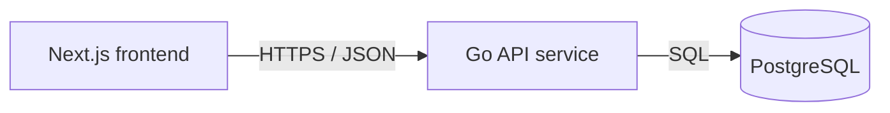

# Service & Interface Design — Todo List App v5

Last updated: 2026-08-12
Source: `docs/tasks/SRS.md`, `docs/architecture/erd.md`, `docs/architecture/overview.md`; story extension: `docs/tasks/stories/complete-tasks.md`

## 1. Service map



| Service | Responsibility | Owns (tables) | Depends on | Deploy unit |
|---|---|---|---|---|
| Frontend web app | Render single todo page, page states, accessible controls, user-facing validation messages, optimistic completion toggle, rollback on save failure, and saved-progress feedback. | none | Go API service | Next.js container |
| Go API service | Own task persistence contract, validate all external API input, expose task CRUD endpoints, run migrations, and translate database failures to stable errors. | `tasks` | PostgreSQL | Go container |
| PostgreSQL | Durable storage for shared todo list. | physical storage for `tasks` | none | PostgreSQL database |

**Why these boundaries** — frontend and API split because browser UI and persistence backend deploy as separate containers and scale differently. Single backend service: no additional backend boundary justified yet. PostgreSQL boundary exists because data durability and query execution are owned by database engine, not application code.

**Entity ownership**

| ERD entity | Owning service | Write access | Read access |
|---|---|---|---|
| `tasks` | Go API service | Go API service only, through parameterized SQL | Frontend reads through Go API only |

## 2. Cross-cutting contract

### 2.1 Base

- Base URL: `{scheme}://{host}/api/v1`
- Content type: `application/json; charset=utf-8`
- Versioning: URL path major version. A new major version only for breaking changes.
- Trace header: `X-Request-Id` accepted from caller, generated if absent, echoed on every response and present in every backend log line.
- JSON naming: `snake_case` for API request and response fields. This service contract is source of truth for API wire shape.
- Timestamps: RFC 3339 UTC strings.
- IDs: UUID strings.

### 2.2 Authentication and authorization

| Aspect | Decision |
|---|---|
| Mechanism | none; SRS requires no login and one shared list |
| Token lifetime | not applicable |
| Refresh | not applicable |
| Transport | no `Authorization` header required or consumed |
| Roles | one anonymous `Visitor` role |
| Enforcement point | handler-level capability: every endpoint allows anonymous visitor |

### 2.3 Error contract

Every non-2xx response, from every endpoint, has this shape:

```json
{
  "error": {
    "code": "VALIDATION_FAILED",
    "message": "Human-readable summary, safe to show a user.",
    "details": [
      { "field": "title", "code": "REQUIRED", "message": "Enter a task title." }
    ],
    "request_id": "01HXEXAMPLE"
  }
}
```

Consumers branch on `code`. `message` is display text and may be reworded at any time without notice, except field-level validation messages explicitly required by SRS. `details[].code` is machine-readable and closed per error instance.

**Mock contract note for Complete tasks** — approved UI mock used local-only `SAVE_FAILED` / `LOAD_FAILED` error codes and summary fields `total`, `active`, `completed`, `completion_rate`. Backend keeps project-wide API contract instead: `BAD_REQUEST`/`VALIDATION_FAILED`/`NOT_FOUND`/`RATE_LIMITED`/`UNAVAILABLE`/`INTERNAL` and `summary.total_count`/`active_count`/`completed_count`/`completion_percent`. Reason: merged service contract already defines closed error catalog and list envelope; adding mock-specific codes or summary names would create second API shape. Frontend integration must map generic non-2xx task toggle failures to existing UI copy: `Status could not be saved. Task returned to last saved state.`

**Error catalog** — full closed set for this project.

| Code | HTTP | Meaning | Retryable |
|---|---|---|---|
| `BAD_REQUEST` | 400 | Malformed JSON, invalid JSON type, unsupported content type, or invalid query value syntax | no |
| `VALIDATION_FAILED` | 422 | Well-formed request failed semantic validation | no |
| `NOT_FOUND` | 404 | Task id does not exist | no |
| `RATE_LIMITED` | 429 | Too many requests; response includes `Retry-After` | yes |
| `INTERNAL` | 500 | Unexpected failure; details are logged, not returned | yes |
| `UNAVAILABLE` | 503 | Database unavailable, service starting, service draining, or dependency timeout | yes |

### 2.4 Pagination

Tasks list is expected to stay small and product requires one shared list with counts and completion meter. Endpoint returns all tasks now, still using collection object shape so pagination can be added later without breaking response top-level shape.

| Aspect | Decision |
|---|---|
| Style | none for v1 task list; no `limit` or `cursor` accepted |
| Default limit | not applicable |
| Max limit | response capped by server at 1 MiB payload; if exceeded return `RATE_LIMITED` with generic list-too-large message |
| Default sort | `created_at DESC, id DESC`, stable and unique |

Future growing collections must use cursor pagination: `?limit=50&cursor=...`, default `50`, max `100`, stable unique sort with primary key tiebreaker.

### 2.5 Validation boundary

Boundary: Go API HTTP handlers after request body size cap and JSON decode, before calling repository/database code. Handlers validate content type, body shape, field type, length, format, path UUIDs, and query parameters. Downstream service/repository code may trust inputs and must not re-validate defensively.

Request body cap: 8 KiB for task write endpoints. Collection response cap: 1 MiB.

### 2.6 Idempotency

No endpoint accepts `Idempotency-Key` in v1.

| Endpoint | Decision |
|---|---|
| `POST /api/v1/tasks` | Non-idempotent by design; duplicate titles are valid separate tasks, and repeated requests create separate rows. |
| `PATCH /api/v1/tasks/{id}` | Non-idempotent per HTTP convention, but setting `is_completed` to same value returns current task with 200 and no extra side effect beyond `updated_at` policy below. |
| `DELETE /api/v1/tasks/{id}` | HTTP-idempotent for existing deletion only until row is gone; repeat after deletion returns `NOT_FOUND` because product needs selected task id semantics. |

## 3. Endpoints

### 3.1 `GET /api/v1/tasks`

**Purpose** — Load saved shared todo list. **Traces to** — TASKS-002, TASKS-005. **Auth** — anonymous visitor.

**Path / query parameters**

| Name | In | Type | Required | Constraints | Description |
|---|---|---|---|---|---|
| none | query | n/a | n/a | no query parameters accepted | List uses fixed system ordering. |

**Request body**

No request body. If body is present, server ignores it.

**Success response** — `200`

```json
{
  "tasks": [
    {
      "id": "2a9d8f6e-0e2f-4ad2-b5f4-3ed5afc8d9f1",
      "title": "Buy milk",
      "is_completed": false,
      "created_at": "2026-08-12T10:04:18Z",
      "updated_at": "2026-08-12T10:04:18Z"
    }
  ],
  "summary": {
    "total_count": 1,
    "active_count": 1,
    "completed_count": 0,
    "completion_percent": 0
  }
}
```

| Field | Type | Nullable | Description |
|---|---|---|---|
| `tasks` | array of task objects | no | Ordered by `created_at DESC, id DESC`. Empty array means no saved tasks. |
| `tasks[].id` | string UUID | no | Stable task id. |
| `tasks[].title` | string | no | Trimmed saved task title, 1 to 80 characters. |
| `tasks[].is_completed` | boolean | no | `true` when complete; `false` when active. |
| `tasks[].created_at` | string timestamp | no | Creation time, RFC 3339 UTC. |
| `tasks[].updated_at` | string timestamp | no | Last status update time, RFC 3339 UTC. |
| `summary.total_count` | integer | no | Total number of tasks returned. |
| `summary.active_count` | integer | no | Number of tasks with `is_completed=false`. |
| `summary.completed_count` | integer | no | Number of tasks with `is_completed=true`. |
| `summary.completion_percent` | integer | no | Rounded whole percent complete. `0` when total is `0`. |

**Errors** — no others.

| Code | HTTP | Trigger |
|---|---|---|
| `BAD_REQUEST` | 400 | Unsupported query parameter is present. |
| `RATE_LIMITED` | 429 | Request rate exceeds project limit or list response would exceed payload cap. |
| `UNAVAILABLE` | 503 | Database unavailable, query timeout, service starting, or service draining. |
| `INTERNAL` | 500 | Unexpected backend failure. |

**Notes** — no side effects. Ordering is stable by `created_at DESC, id DESC`. Frontend uses this endpoint for loading, retrying load errors, refreshing counts, completion meter, empty state, loading state resolution, and saved state.

### 3.2 `POST /api/v1/tasks`

**Purpose** — Create saved active task. **Traces to** — TASKS-001, TASKS-005. **Auth** — anonymous visitor.

**Path / query parameters**

| Name | In | Type | Required | Constraints | Description |
|---|---|---|---|---|---|
| none | query | n/a | n/a | no query parameters accepted | Creation behavior is fixed. |

**Request body**

```json
{
  "title": "Buy milk"
}
```

| Field | Type | Required | Constraints | Description |
|---|---|---|---|---|
| `title` | string | yes | Trim leading/trailing whitespace before validation and save. Trimmed length 1 to 80 characters. Duplicate titles allowed. | Task title shown in list. |

**Success response** — `201`

Header: `Location: /api/v1/tasks/{id}`

```json
{
  "id": "2a9d8f6e-0e2f-4ad2-b5f4-3ed5afc8d9f1",
  "title": "Buy milk",
  "is_completed": false,
  "created_at": "2026-08-12T10:04:18Z",
  "updated_at": "2026-08-12T10:04:18Z"
}
```

| Field | Type | Nullable | Description |
|---|---|---|---|
| `id` | string UUID | no | Stable task id for update and delete. |
| `title` | string | no | Trimmed saved title. |
| `is_completed` | boolean | no | Always `false` for new tasks. |
| `created_at` | string timestamp | no | Creation time, RFC 3339 UTC. |
| `updated_at` | string timestamp | no | Initially same as `created_at`. |

**Errors** — no others.

| Code | HTTP | Trigger |
|---|---|---|
| `BAD_REQUEST` | 400 | Missing JSON body, malformed JSON, invalid field type, unsupported content type, request body over 8 KiB, or unsupported query parameter. |
| `VALIDATION_FAILED` | 422 | Trimmed `title` is empty or over 80 characters. Empty title detail message must be `Enter a task title.` Over-limit detail message must name 80-character limit. |
| `RATE_LIMITED` | 429 | Request rate exceeds project limit. |
| `UNAVAILABLE` | 503 | Database unavailable, insert timeout, service starting, or service draining. |
| `INTERNAL` | 500 | Unexpected backend failure. |

**Notes** — no `Idempotency-Key`; retry can create duplicate task, which is allowed only when user intentionally retries. Frontend clears input only after `201`. On error frontend leaves current saved list unchanged and shows error notice. Backend trims title before save.

### 3.3 `GET /api/v1/tasks/{id}`

**Purpose** — Fetch one saved task by stable id for client reconciliation or direct refresh. **Traces to** — TASKS-002. **Auth** — anonymous visitor.

**Path / query parameters**

| Name | In | Type | Required | Constraints | Description |
|---|---|---|---|---|---|
| `id` | path | string UUID | yes | valid UUID | Stable task id. |

**Request body**

No request body. If body is present, server ignores it.

**Success response** — `200`

```json
{
  "id": "2a9d8f6e-0e2f-4ad2-b5f4-3ed5afc8d9f1",
  "title": "Buy milk",
  "is_completed": false,
  "created_at": "2026-08-12T10:04:18Z",
  "updated_at": "2026-08-12T10:04:18Z"
}
```

| Field | Type | Nullable | Description |
|---|---|---|---|
| `id` | string UUID | no | Stable task id. |
| `title` | string | no | Saved title. |
| `is_completed` | boolean | no | Completion status. |
| `created_at` | string timestamp | no | Creation time. |
| `updated_at` | string timestamp | no | Last status update time. |

**Errors** — no others.

| Code | HTTP | Trigger |
|---|---|---|
| `BAD_REQUEST` | 400 | `id` is not a UUID or unsupported query parameter is present. |
| `NOT_FOUND` | 404 | No task exists with that id. |
| `RATE_LIMITED` | 429 | Request rate exceeds project limit. |
| `UNAVAILABLE` | 503 | Database unavailable, query timeout, service starting, or service draining. |
| `INTERNAL` | 500 | Unexpected backend failure. |

**Notes** — no side effects. Main UI may not need this endpoint, but direct resource URL is additive and keeps `Location` from create dereferenceable.

### 3.4 `PATCH /api/v1/tasks/{id}`

**Purpose** — Mark task complete or active. **Traces to** — TASKS-003, TASKS-005. **Auth** — anonymous visitor.

**Path / query parameters**

| Name | In | Type | Required | Constraints | Description |
|---|---|---|---|---|---|
| `id` | path | string UUID | yes | valid UUID | Stable task id to update. |

**Request body**

```json
{
  "is_completed": true
}
```

| Field | Type | Required | Constraints | Description |
|---|---|---|---|---|
| `is_completed` | boolean | yes | closed set: `true` or `false`; JSON boolean only, not string | Desired completion status. |

No other fields are accepted. Title editing is out of scope.

**Success response** — `200`

```json
{
  "id": "2a9d8f6e-0e2f-4ad2-b5f4-3ed5afc8d9f1",
  "title": "Buy milk",
  "is_completed": true,
  "created_at": "2026-08-12T10:04:18Z",
  "updated_at": "2026-08-12T10:05:03Z"
}
```

| Field | Type | Nullable | Description |
|---|---|---|---|
| `id` | string UUID | no | Stable task id. |
| `title` | string | no | Saved title, unchanged. |
| `is_completed` | boolean | no | Persisted completion status after update. |
| `created_at` | string timestamp | no | Creation time, unchanged. |
| `updated_at` | string timestamp | no | Update time. If requested value already matched saved value, backend may leave `updated_at` unchanged. |

**Errors** — no others.

| Code | HTTP | Trigger |
|---|---|---|
| `BAD_REQUEST` | 400 | `id` is not a UUID, missing JSON body, malformed JSON, invalid field type, unsupported content type, request body over 8 KiB, unsupported query parameter, or unsupported request field. |
| `VALIDATION_FAILED` | 422 | `is_completed` is omitted. |
| `NOT_FOUND` | 404 | No task exists with that id. |
| `RATE_LIMITED` | 429 | Request rate exceeds project limit. |
| `UNAVAILABLE` | 503 | Database unavailable, update timeout, service starting, or service draining. |
| `INTERNAL` | 500 | Unexpected backend failure. |

**Repository operation**

```sql
UPDATE tasks
SET is_completed = $1,
    updated_at = CASE
        WHEN is_completed IS DISTINCT FROM $1 THEN now()
        ELSE updated_at
    END
WHERE id = $2
RETURNING id, title, is_completed, created_at, updated_at;
```

Use parameterized SQL. No lookup by title. A zero-row result maps to `NOT_FOUND`.

**Mock compatibility** — approved UI mock returned `{ tasks, summary }` after update. Backend returns only updated task object to keep write endpoint small and match existing contract. Frontend integration must replace selected row by `id` locally and recalculate counts/meter, or call `GET /api/v1/tasks` after success if it needs server-derived summary. This is intentional because ERD gives all fields needed for local recalculation and no reorder is caused by status change.

**Notes** — frontend may update optimistically but must roll back to last saved state on non-2xx and show error notice. Backend persists exact requested boolean. Counts, completion meter, task styling, and saved-progress feedback update from success response plus local recalculation or follow-up list load.

### 3.5 `DELETE /api/v1/tasks/{id}`

**Purpose** — Hard delete selected task. **Traces to** — TASKS-004, TASKS-005. **Auth** — anonymous visitor.

**Path / query parameters**

| Name | In | Type | Required | Constraints | Description |
|---|---|---|---|---|---|
| `id` | path | string UUID | yes | valid UUID | Stable task id to delete. |

**Request body**

No request body. If body is present, server ignores it.

**Success response** — `204`

No response body.

| Field | Type | Nullable | Description |
|---|---|---|---|
| none | n/a | n/a | 204 has no body. |

**Errors** — no others.

| Code | HTTP | Trigger |
|---|---|---|
| `BAD_REQUEST` | 400 | `id` is not a UUID or unsupported query parameter is present. |
| `NOT_FOUND` | 404 | No task exists with that id, including repeat delete after success. |
| `RATE_LIMITED` | 429 | Request rate exceeds project limit. |
| `UNAVAILABLE` | 503 | Database unavailable, delete timeout, service starting, or service draining. |
| `INTERNAL` | 500 | Unexpected backend failure. |

**Notes** — hard delete only selected id. Duplicate titles are unaffected unless their id matches. Frontend removes task only after `204`; on error task remains visible and error notice appears. No confirmation dialog in this version.

## 4. Asynchronous work

No jobs, queues, schedules, or events in v1.

| Name | Trigger | Payload | Retry | Backoff | Dead letter | Idempotent |
|---|---|---|---|---|---|---|
| none | n/a | n/a | n/a | n/a | n/a | n/a |

## 5. External integrations

No third-party calls or external-service dependencies. No secrets or provider setup required.

| System | Purpose | Protocol | Timeout | Retry | On failure | Secrets |
|---|---|---|---|---|---|---|
| PostgreSQL | Persist and read shared tasks | SQL over driver connection | 2 seconds per query; 5 seconds startup health/migration checks | No automatic retry for writes; reads may be retried once only when context not canceled and no rows were streamed | API returns `UNAVAILABLE`; frontend shows retryable load error or per-action error notice and preserves last saved UI state | `DATABASE_URL` from environment |

**Cross-service calls**

| Caller | Callee | Mode | Timeout | Retry | Idempotency key | Failure behavior |
|---|---|---|---|---|---|---|
| Frontend | Go API service | synchronous HTTPS JSON | 8 seconds per request | UI may retry `GET /tasks` on user action only; no automatic retry for `POST`, `PATCH`, or `DELETE` | none | Loading failure shows retryable error state; create/update/delete failure shows error notice and preserves or rolls back visible list per endpoint notes. |
| Go API service | PostgreSQL | synchronous SQL | 2 seconds per query | no automatic retry for writes; reads may retry once before response if no partial response was sent | none | API returns stable error shape with `UNAVAILABLE` or `INTERNAL`; logs include `request_id`. |

## 6. Non-functional targets

| Aspect | Target |
|---|---|
| p95 latency (read) | `GET /api/v1/tasks` under 300 ms for up to 1,000 tasks on local network excluding browser render |
| p95 latency (write) | create, patch, delete under 300 ms excluding browser render |
| Availability | best-effort single service; health returns 503 while database unavailable |
| Rate limit | per source IP: 60 writes/minute, 300 reads/minute; return `RATE_LIMITED` with `Retry-After` when exceeded |
| Payload cap | 8 KiB request body for writes; 1 MiB response body for task list |
| Timeout (inbound) | 10 seconds total request handling; 2 seconds database operation budget inside it |

## 7. Observability

- Log fields present on every request line: `request_id`, method, path template, status, duration_ms, remote_addr, user_agent, error_code when present.
- Metrics per endpoint: request count, error count by code, duration histogram, database operation duration.
- Never logged: full task titles, full request bodies, environment variable values, database URLs, stack traces in responses, SQL with interpolated values.
- User-controlled task titles may contain personal data by user choice; logs must not store them.

## 8. Contract evolution

| Change | Additive or breaking | Migration path |
|---|---|---|
| Add optional response field to task object | additive | Frontend ignores unknown fields. |
| Add optional query filter that defaults to current behavior | additive | Keep default ordering and full-list behavior unchanged. |
| Add endpoint for editing task title | additive | New `PATCH` field or endpoint must preserve current completion update semantics. |
| Rename any existing JSON field | breaking | Add `/api/v2`, migrate frontend, then deprecate `/api/v1` with `Deprecation` header and date. |
| Change default sort from `created_at DESC, id DESC` | breaking | Add explicit sort parameter first, migrate frontend, then new major version. |
| Require authentication or private lists | breaking | New major version and data migration plan. |
| Change validation limits for `title` below current 1..80 | breaking | PM approval, new major version, and migration for existing rows. |

## 9. Requirement traceability

| Requirement | Endpoint coverage | Notes |
|---|---|---|
| TASKS-001 Add persistent tasks | `POST /api/v1/tasks`, `GET /api/v1/tasks` | Create saves active task; list proves persistence after refresh. |
| TASKS-002 View saved tasks | `GET /api/v1/tasks`, `GET /api/v1/tasks/{id}` | List returns saved task title, status, stable ordering, and summary. |
| TASKS-003 Complete tasks | `PATCH /api/v1/tasks/{id}`, `GET /api/v1/tasks` | Patch persists active/complete status; list verifies after refresh. |
| TASKS-004 Delete tasks | `DELETE /api/v1/tasks/{id}`, `GET /api/v1/tasks` | Delete targets stable id; list verifies removal. |
| TASKS-005 Polish todo page | all task endpoints | API exposes loading/error/saved data states and stable errors for UI feedback. |

## 10. Migration plan for Complete tasks

| Step | Forward | Backward | Safe on populated table |
|---|---|---|---|
| 1 | No schema change; reuse `tasks.is_completed` and `tasks.updated_at`. | No schema rollback. | Yes; no table rewrite or lock beyond normal row update. |
| 2 | Add `PATCH /api/v1/tasks/{id}` handler and repository update using primary key and parameterized SQL. | Roll back code to previous service revision. | Yes; requests update one selected row only. |
| 3 | Frontend integration sends `{"is_completed": boolean}` and handles non-2xx with rollback to last saved task state. | Roll back frontend integration to mock/static behavior if needed. | Yes; no data migration. |

## 11. Open questions

| Question | Owner | Blocking |
|---|---|---|
| none | n/a | no |
